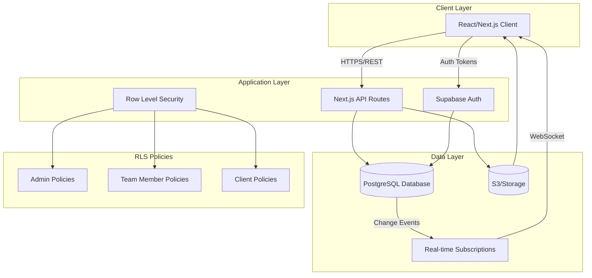
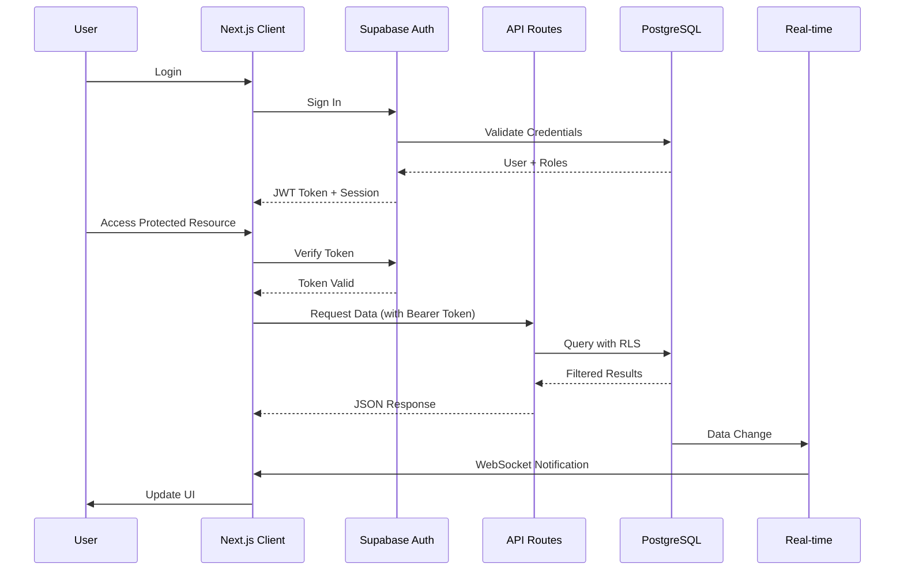
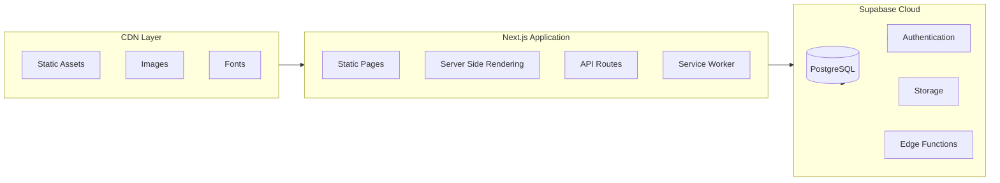
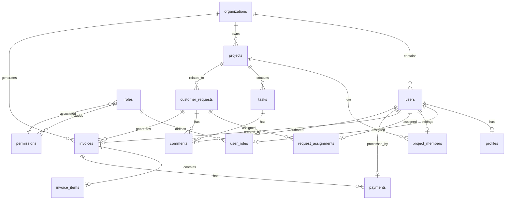
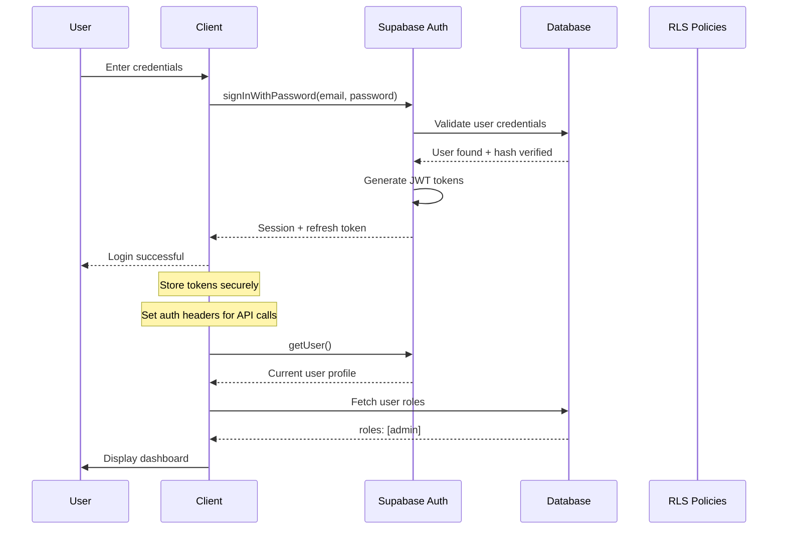
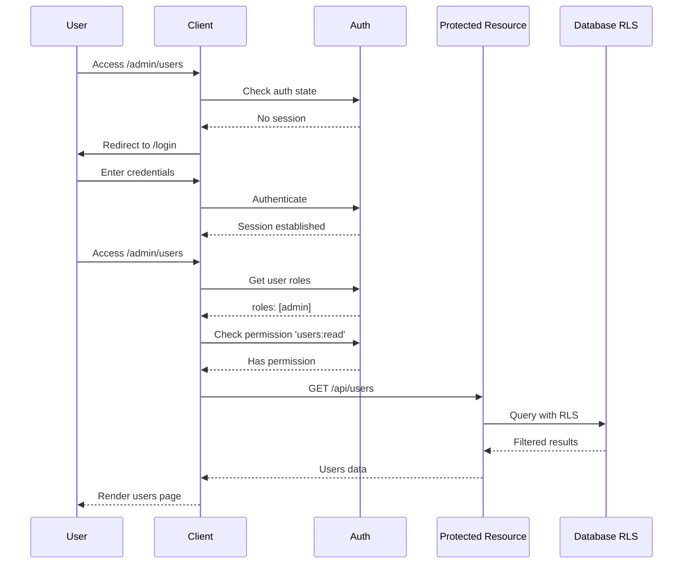

# Weber Management System - Design Document

## Overview

The Weber Management System is a comprehensive project management platform built with React/Next.js and Supabase. It provides organizations with tools to manage projects, tasks, customer requests, invoicing, and team collaboration. The system implements role-based access control with three distinct roles: admin, team_member, and client. The application follows a modern BFF (Backend-for-Frontend) architecture pattern with Supabase handling authentication, database operations, and real-time subscriptions.

## System Architecture

### High-Level Architecture



### Component Interaction Flow



### Infrastructure Architecture



## Database Schema

### Entity Relationship Diagram



### Core Tables

#### 1. users

```sql
CREATE TABLE users (
    id UUID PRIMARY KEY DEFAULT gen_random_uuid(),
    email VARCHAR(255) UNIQUE NOT NULL,
    password_hash VARCHAR(255) NOT NULL,
    organization_id UUID REFERENCES organizations(id),
    is_active BOOLEAN DEFAULT true,
    last_login TIMESTAMP WITH TIME ZONE,
    created_at TIMESTAMP WITH TIME ZONE DEFAULT NOW(),
    updated_at TIMESTAMP WITH TIME ZONE DEFAULT NOW()
);
```

#### 2. profiles

```sql
CREATE TABLE profiles (
    id UUID PRIMARY KEY DEFAULT gen_random_uuid(),
    user_id UUID REFERENCES users(id) ON DELETE CASCADE,
    first_name VARCHAR(100) NOT NULL,
    last_name VARCHAR(100) NOT NULL,
    avatar_url TEXT,
    phone VARCHAR(50),
    title VARCHAR(100),
    bio TEXT,
    timezone VARCHAR(50) DEFAULT 'UTC',
    locale VARCHAR(10) DEFAULT 'en-US',
    notification_preferences JSONB DEFAULT '{}',
    created_at TIMESTAMP WITH TIME ZONE DEFAULT NOW(),
    updated_at TIMESTAMP WITH TIME ZONE DEFAULT NOW()
);
```

#### 3. organizations

```sql
CREATE TABLE organizations (
    id UUID PRIMARY KEY DEFAULT gen_random_uuid(),
    name VARCHAR(200) NOT NULL,
    slug VARCHAR(100) UNIQUE NOT NULL,
    logo_url TEXT,
    primary_color VARCHAR(7) DEFAULT '#1976D2',
    address TEXT,
    website VARCHAR(255),
    settings JSONB DEFAULT '{}',
    subscription_tier VARCHAR(50) DEFAULT 'free',
    created_at TIMESTAMP WITH TIME ZONE DEFAULT NOW(),
    updated_at TIMESTAMP WITH TIME ZONE DEFAULT NOW()
);
```

#### 4. roles

```sql
CREATE TABLE roles (
    id UUID PRIMARY KEY DEFAULT gen_random_uuid(),
    organization_id UUID REFERENCES organizations(id),
    name VARCHAR(50) NOT NULL,
    description TEXT,
    is_system_role BOOLEAN DEFAULT false,
    created_at TIMESTAMP WITH TIME ZONE DEFAULT NOW()
);
```

#### 5. permissions

```sql
CREATE TABLE permissions (
    id UUID PRIMARY KEY DEFAULT gen_random_uuid(),
    name VARCHAR(100) UNIQUE NOT NULL,
    resource VARCHAR(100) NOT NULL,
    action VARCHAR(50) NOT NULL,
    description TEXT,
    created_at TIMESTAMP WITH TIME ZONE DEFAULT NOW()
);
```

#### 6. user_roles

```sql
CREATE TABLE user_roles (
    id UUID PRIMARY KEY DEFAULT gen_random_uuid(),
    user_id UUID REFERENCES users(id) ON DELETE CASCADE,
    role_id UUID REFERENCES roles(id) ON DELETE CASCADE,
    assigned_by UUID REFERENCES users(id),
    created_at TIMESTAMP WITH TIME ZONE DEFAULT NOW(),
    UNIQUE(user_id, role_id)
);
```

#### 7. projects

```sql
CREATE TABLE projects (
    id UUID PRIMARY KEY DEFAULT gen_random_uuid(),
    organization_id UUID REFERENCES organizations(id),
    name VARCHAR(200) NOT NULL,
    description TEXT,
    status VARCHAR(50) DEFAULT 'planning',
    start_date DATE,
    end_date DATE,
    budget DECIMAL(12, 2),
    settings JSONB DEFAULT '{}',
    created_by UUID REFERENCES users(id),
    created_at TIMESTAMP WITH TIME ZONE DEFAULT NOW(),
    updated_at TIMESTAMP WITH TIME ZONE DEFAULT NOW()
);
```

#### 8. project_members

```sql
CREATE TABLE project_members (
    id UUID PRIMARY KEY DEFAULT gen_random_uuid(),
    project_id UUID REFERENCES projects(id) ON DELETE CASCADE,
    user_id UUID REFERENCES users(id) ON DELETE CASCADE,
    role VARCHAR(50) DEFAULT 'member',
    joined_at TIMESTAMP WITH TIME ZONE DEFAULT NOW(),
    UNIQUE(project_id, user_id)
);
```

#### 9. tasks

```sql
CREATE TABLE tasks (
    id UUID PRIMARY KEY DEFAULT gen_random_uuid(),
    project_id UUID REFERENCES projects(id) ON DELETE CASCADE,
    parent_task_id UUID REFERENCES tasks(id),
    title VARCHAR(255) NOT NULL,
    description TEXT,
    status VARCHAR(50) DEFAULT 'backlog',
    priority VARCHAR(20) DEFAULT 'medium',
    assignee_id UUID REFERENCES users(id),
    due_date TIMESTAMP WITH TIME ZONE,
    estimated_hours DECIMAL(8, 2),
    actual_hours DECIMAL(8, 2),
    order_index INTEGER DEFAULT 0,
    tags TEXT[],
    created_by UUID REFERENCES users(id),
    created_at TIMESTAMP WITH TIME ZONE DEFAULT NOW(),
    updated_at TIMESTAMP WITH TIME ZONE DEFAULT NOW()
);
```

#### 10. customer_requests

```sql
CREATE TABLE customer_requests (
    id UUID PRIMARY KEY DEFAULT gen_random_uuid(),
    organization_id UUID REFERENCES organizations(id),
    project_id UUID REFERENCES projects(id),
    client_id UUID REFERENCES users(id),
    title VARCHAR(255) NOT NULL,
    description TEXT,
    status VARCHAR(50) DEFAULT 'new',
    priority VARCHAR(20) DEFAULT 'medium',
    request_type VARCHAR(50),
    metadata JSONB DEFAULT '{}',
    created_by UUID REFERENCES users(id),
    created_at TIMESTAMP WITH TIME ZONE DEFAULT NOW(),
    updated_at TIMESTAMP WITH TIME ZONE DEFAULT NOW()
);
```

#### 11. request_assignments

```sql
CREATE TABLE request_assignments (
    id UUID PRIMARY KEY DEFAULT gen_random_uuid(),
    request_id UUID REFERENCES customer_requests(id) ON DELETE CASCADE,
    assignee_id UUID REFERENCES users(id) ON DELETE CASCADE,
    assigned_by UUID REFERENCES users(id),
    assigned_at TIMESTAMP WITH TIME ZONE DEFAULT NOW(),
    status VARCHAR(50) DEFAULT 'in_progress',
    notes TEXT,
    UNIQUE(request_id, assignee_id)
);
```

#### 12. invoices

```sql
CREATE TABLE invoices (
    id UUID PRIMARY KEY DEFAULT gen_random_uuid(),
    organization_id UUID REFERENCES organizations(id),
    customer_id UUID REFERENCES users(id),
    project_id UUID REFERENCES projects(id),
    invoice_number VARCHAR(50) UNIQUE NOT NULL,
    status VARCHAR(50) DEFAULT 'draft',
    issue_date DATE NOT NULL,
    due_date DATE NOT NULL,
    subtotal DECIMAL(12, 2) DEFAULT 0,
    tax_rate DECIMAL(5, 2) DEFAULT 0,
    tax_amount DECIMAL(12, 2) DEFAULT 0,
    discount DECIMAL(12, 2) DEFAULT 0,
    total DECIMAL(12, 2) DEFAULT 0,
    notes TEXT,
    terms TEXT,
    created_by UUID REFERENCES users(id),
    created_at TIMESTAMP WITH TIME ZONE DEFAULT NOW(),
    updated_at TIMESTAMP WITH TIME ZONE DEFAULT NOW()
);
```

#### 13. invoice_items

```sql
CREATE TABLE invoice_items (
    id UUID PRIMARY KEY DEFAULT gen_random_uuid(),
    invoice_id UUID REFERENCES invoices(id) ON DELETE CASCADE,
    description VARCHAR(500) NOT NULL,
    quantity DECIMAL(10, 2) NOT NULL,
    unit_price DECIMAL(12, 2) NOT NULL,
    amount DECIMAL(12, 2) NOT NULL,
    tax_rate DECIMAL(5, 2) DEFAULT 0,
    sort_order INTEGER DEFAULT 0
);
```

#### 14. payments

```sql
CREATE TABLE payments (
    id UUID PRIMARY KEY DEFAULT gen_random_uuid(),
    invoice_id UUID REFERENCES invoices(id) ON DELETE CASCADE,
    amount DECIMAL(12, 2) NOT NULL,
    payment_method VARCHAR(50) NOT NULL,
    status VARCHAR(50) DEFAULT 'pending',
    transaction_id VARCHAR(255),
    processed_by UUID REFERENCES users(id),
    processed_at TIMESTAMP WITH TIME ZONE,
    notes TEXT,
    created_at TIMESTAMP WITH TIME ZONE DEFAULT NOW()
);
```

#### 15. comments

```sql
CREATE TABLE comments (
    id UUID PRIMARY KEY DEFAULT gen_random_uuid(),
    user_id UUID REFERENCES users(id) ON DELETE CASCADE,
    task_id UUID REFERENCES tasks(id) ON DELETE CASCADE,
    request_id UUID REFERENCES customer_requests(id) ON DELETE CASCADE,
    parent_id UUID REFERENCES comments(id) ON DELETE CASCADE,
    content TEXT NOT NULL,
    attachments JSONB DEFAULT '[]',
    is_internal BOOLEAN DEFAULT true,
    created_at TIMESTAMP WITH TIME ZONE DEFAULT NOW(),
    updated_at TIMESTAMP WITH TIME ZONE DEFAULT NOW()
);
```

## React Component Architecture

### Component Hierarchy

```mermaid
graph TD
    subgraph App["App Components"]
        App["App Root"]
        ThemeProvider
        AuthProvider
    end

    subgraph Layout["Layout Components"]
        Layout["Main Layout"]
        Sidebar
        Header
        Footer
    end

    subgraph Auth["Authentication"]
        LoginPage
        RegisterPage
        ForgotPassword
        ResetPassword
        VerifyEmail
    end

    subgraph Dashboard["Dashboard"]
        DashboardPage
        StatsCards
        ActivityFeed
        RecentProjects
        PendingTasks
    end

    subgraph Projects["Projects"]
        ProjectsPage
        ProjectList
        ProjectCard
        ProjectDetail
        ProjectForm
        ProjectSettings
        ProjectMembers
    end

    subgraph Tasks["Tasks"]
        TasksPage
        TaskList
        TaskCard
        TaskBoard
        TaskDetail
        TaskForm
        TaskComments
        TaskActivity
    end

    subgraph Requests["Customer Requests"]
        RequestsPage
        RequestList
        RequestCard
        RequestDetail
        RequestForm
        RequestAssignments
    end

    subgraph Invoices["Invoices"]
        InvoicesPage
        InvoiceList
        InvoiceCard
        InvoiceDetail
        InvoiceForm
        InvoiceItems
        PaymentForm
    end

    subgraph Team["Team Management"]
        TeamPage
        MemberList
        MemberCard
        MemberDetail
        RoleManager
        InviteMember
    end

    subgraph Settings["Settings"]
        SettingsPage
        ProfileSettings
        OrganizationSettings
        NotificationSettings
        SecuritySettings
        BillingSettings
    end

    subgraph Shared["Shared Components"]
        Button
        Input
        Select
        Modal
        Table
        Form
        Card
        Badge
        Avatar
        Dropdown
        Toast
        Spinner
        EmptyState
    end

    App --> Layout
    App --> Auth
    Layout --> Dashboard
    Layout --> Projects
    Layout --> Tasks
    Layout --> Requests
    Layout --> Invoices
    Layout --> Team
    Layout --> Settings

    Dashboard --> Shared
    Projects --> Shared
    Tasks --> Shared
    Requests --> Shared
    Invoices --> Shared
    Team --> Shared
    Settings --> Shared
```

### Component Specifications

#### Layout Components (4)

| Component | Props | Description |
|-----------|-------|-------------|
| MainLayout | children, sidebarCollapsed | Main application layout with sidebar and header |
| Sidebar | collapsed, onToggle | Navigation sidebar with menu items |
| Header | user, notifications, actions | Top navigation bar with user menu |
| Footer | version, links | Application footer |

#### Authentication Components (6)

| Component | Props | Description |
|-----------|-------|-------------|
| LoginPage | onLogin, onForgotPassword | User login form |
| RegisterPage | onRegister, onLogin | User registration form |
| ForgotPassword | email, onSubmit | Password recovery request |
| ResetPassword | token, onReset | Password reset form |
| VerifyEmail | email, onResend | Email verification UI |
| AuthCallback | provider, onComplete | OAuth callback handler |

#### Dashboard Components (5)

| Component | Props | Description |
|-----------|-------|-------------|
| DashboardPage | - | Main dashboard container |
| StatsCards | stats: Stats[] | Summary statistics display |
| ActivityFeed | activities: Activity[] | Recent activity timeline |
| RecentProjects | projects: Project[] | Quick project access |
| PendingTasks | tasks: Task[] | Task quick view |

#### Project Components (7)

| Component | Props | Description |
|-----------|-------|-------------|
| ProjectsPage | - | Projects listing container |
| ProjectList | projects, onSelect | Project listing grid/list |
| ProjectCard | project, onClick | Individual project display |
| ProjectDetail | project, onUpdate | Full project view |
| ProjectForm | project, onSubmit | Project create/edit form |
| ProjectSettings | project, onSave | Project configuration |
| ProjectMembers | members, onManage | Team member management |

#### Task Components (8)

| Component | Props | Description |
|-----------|-------|-------------|
| TasksPage | projectId | Tasks management container |
| TaskList | tasks, view | List view of tasks |
| TaskCard | task, onClick | Individual task display |
| TaskBoard | tasks, columns | Kanban board view |
| TaskDetail | task, onUpdate | Full task view |
| TaskForm | task, onSubmit | Task create/edit form |
| TaskComments | taskId, comments | Task comments section |
| TaskActivity | activities | Task history log |

#### Customer Request Components (6)

| Component | Props | Description |
|-----------|-------|-------------|
| RequestsPage | - | Requests container |
| RequestList | requests, filters | Request listing |
| RequestCard | request, onClick | Individual request display |
| RequestDetail | request, onUpdate | Full request view |
| RequestForm | request, onSubmit | Request create/edit |
| RequestAssignments | request, assignees | Assignment management |

#### Invoice Components (7)

| Component | Props | Description |
|-----------|-------|-------------|
| InvoicesPage | - | Invoices container |
| InvoiceList | invoices, filters | Invoice listing |
| InvoiceCard | invoice, onClick | Invoice summary |
| InvoiceDetail | invoice, onUpdate | Full invoice view |
| InvoiceForm | invoice, onSubmit | Invoice create/edit |
| InvoiceItems | items, onUpdate | Line items management |
| PaymentForm | invoice, onSubmit | Payment entry |

#### Team Components (6)

| Component | Props | Description |
|-----------|-------|-------------|
| TeamPage | - | Team management container |
| MemberList | members, onSelect | Team member listing |
| MemberCard | member, onAction | Member profile card |
| MemberDetail | member, onUpdate | Full member profile |
| RoleManager | roles, onAssign | Role assignment |
| InviteMember | onInvite | Invite new member |

#### Settings Components (5)

| Component | Props | Description |
|-----------|-------|-------------|
| SettingsPage | - | Settings container |
| ProfileSettings | profile, onSave | User profile settings |
| OrganizationSettings | org, onSave | Organization settings |
| NotificationSettings | prefs, onSave | Notification preferences |
| SecuritySettings | user, onSave | Security configuration |

#### Shared Components (17)

| Component | Props | Description |
|-----------|-------|-------------|
| Button | variant, size, disabled | Reusable button |
| Input | name, label, error, type | Form input field |
| Select | options, value, onChange | Dropdown select |
| Modal | isOpen, onClose, title | Modal dialog |
| Table | columns, data, onSort | Data table |
| Form | schema, onSubmit | Form wrapper |
| Card | title, children | Content card |
| Badge | variant, label | Status badge |
| Avatar | src, alt, size | User avatar |
| Dropdown | trigger, items | Dropdown menu |
| Toast | message, type | Notification toast |
| Spinner | size, color | Loading spinner |
| EmptyState | icon, title, action | Empty content |
| Tooltip | content, children | Tooltip wrapper |
| Tabs | tabs, activeTab | Tab navigation |
| Pagination | total, page, onPage | Page navigation |
| SearchBar | value, onChange | Search input |

## Authentication & Authorization Flow

### Authentication Flow



### Role-Based Access Control

```mermaid
graph TD
    subgraph Authentication
        AUTH[Auth Service]
        TOK[JWT Token]
    end

    subgraph Claims
        SUB[sub: user_id]
        EMAIL[email]
        ORG[org_id]
        ROLES[roles: []]
        PERMS[permissions: []]
    end

    subgraph Roles
        ADMIN[Admin]
        TEAM[Team Member]
        CLIENT[Client]
    end

    subgraph Permissions
        P1[Full Access]
        P2[Project Access]
        P3[Client Access]
    end

    AUTH --> TOK
    TOK --> ROLES
    TOK --> PERMS
    ROLES --> ADMIN
    ROLES --> TEAM
    ROLES --> CLIENT
    ADMIN --> P1
    TEAM --> P2
    CLIENT --> P3
```

### Role Permissions Matrix

| Resource | Action | Admin | Team Member | Client |
|----------|--------|-------|-------------|--------|
| Users | Read | All | Team Only | Self |
| Users | Create | Yes | No | No |
| Users | Update | All | Team Only | Self |
| Users | Delete | All | No | No |
| Projects | Read | All | Org + Assigned | Assigned Only |
| Projects | Create | Yes | Yes | No |
| Projects | Update | All | Assigned + Team Lead | No |
| Projects | Delete | Yes | No | No |
| Tasks | Read | All | Org + Assigned | Assigned Only |
| Tasks | Create | Yes | Yes | No |
| Tasks | Update | All | Assigned + Team Lead | Assigned Only |
| Tasks | Delete | All | Assigned + Team Lead | No |
| Requests | Read | All | Org + Assigned | Own Requests |
| Requests | Create | Yes | Yes | Yes |
| Requests | Update | All | Assigned + Team Lead | Own + Pending |
| Requests | Delete | Yes | No | Own + Pending |
| Invoices | Read | All | Org + Assigned | Own Only |
| Invoices | Create | Yes | No | No |
| Invoices | Update | All | No | No |
| Invoices | Delete | Draft Only | No | No |
| Payments | Read | All | Org + Assigned | Own Only |
| Payments | Create | Yes | No | Yes |
| Team | Manage | Yes | No | No |
| Settings | Manage | Org Settings | No | Profile Only |

### Protected Route Flow



### Supabase RLS Policy Examples

```sql
-- Admin role gets full access
CREATE POLICY "admins_full_access" ON users
    FOR ALL
    USING (
        EXISTS (
            SELECT 1 FROM user_roles ur
            JOIN roles r ON r.id = ur.role_id
            WHERE ur.user_id = auth.uid()
            AND r.name = 'admin'
        )
    );

-- Users can read own profile
CREATE POLICY "users_read_own" ON profiles
    FOR SELECT
    USING (user_id = auth.uid());

-- Team members can read all users in organization
CREATE POLICY "team_read_all" ON users
    FOR SELECT
    USING (
        EXISTS (
            SELECT 1 FROM user_roles ur
            WHERE ur.user_id = auth.uid()
            AND ur.role_id IN (SELECT id FROM roles WHERE name IN ('admin', 'team_member'))
        )
        AND users.organization_id = (
            SELECT organization_id FROM users WHERE id = auth.uid()
        )
    );

-- Clients can read own requests only
CREATE POLICY "clients_read_own_requests" ON customer_requests
    FOR SELECT
    USING (
        client_id = auth.uid()
        OR EXISTS (
            SELECT 1 FROM user_roles ur
            WHERE ur.user_id = auth.uid()
            AND ur.role_id IN (SELECT id FROM roles WHERE name IN ('admin', 'team_member'))
        )
    );
```

## Implementation Roadmap

### Phase 1: Foundation (Weeks 1-3)

**Objective**: Establish core infrastructure and authentication

| Task | Duration | Dependencies |
|------|----------|--------------|
| Set up Next.js project with TypeScript | 2 days | None |
| Configure Supabase project | 1 day | None |
| Implement authentication system | 5 days | Supabase |
| Create database schema | 3 days | None |
| Build core layout components | 3 days | Auth |
| Implement theme system | 2 days | Layout |
| Create shared component library | 5 days | Layout |
| Set up CI/CD pipeline | 2 days | None |
| Write unit test foundation | 3 days | Components |

**Deliverables**:
- Next.js application with TypeScript
- Supabase authentication (email/password, OAuth)
- 17 shared UI components
- Basic layout (sidebar, header, footer)
- Theme configuration (black/grey/#1976D2)

### Phase 2: Core Features (Weeks 4-7)

**Objective**: Implement project and task management

| Task | Duration | Dependencies |
|------|----------|--------------|
| Build organization management | 4 days | Phase 1 |
| Implement user management | 4 days | Phase 1 |
| Create project CRUD operations | 5 days | Organization |
| Build project member management | 3 days | Project CRUD |
| Implement task management system | 6 days | Project CRUD |
| Create task board view | 4 days | Task CRUD |
| Build task detail and comments | 3 days | Task CRUD |
| Implement real-time updates | 3 days | Tasks |
| Write integration tests | 4 days | Features |

**Deliverables**:
- Organization management
- User invitation and role assignment
- Project creation, editing, deletion
- Project member management
- Task management with Kanban board
- Real-time task updates

### Phase 3: Customer Features (Weeks 8-11)

**Objective**: Implement customer request and invoicing

| Task | Duration | Dependencies |
|------|----------|--------------|
| Build customer request system | 6 days | Phase 2 |
| Implement request assignments | 4 days | Requests |
| Create invoice management | 5 days | Phase 2 |
| Build invoice item system | 3 days | Invoices |
| Implement payment tracking | 4 days | Invoices |
| Create dashboard analytics | 5 days | All features |
| Build activity feed | 3 days | All features |
| Implement notification system | 4 days | Auth |
| Write integration tests | 5 days | Features |

**Deliverables**:
- Customer request tracking
- Request assignment workflow
- Invoice generation and management
- Payment tracking
- Dashboard with analytics
- Activity notifications

### Phase 4: Polish & Scale (Weeks 12-14)

**Objective**: Security hardening and performance optimization

| Task | Duration | Dependencies |
|------|----------|--------------|
| Implement advanced RLS policies | 4 days | Phase 3 |
| Performance optimization | 5 days | All features |
| Security audit and fixes | 4 days | RLS |
| Accessibility audit | 3 days | All features |
| Mobile responsive design | 4 days | All features |
| Documentation and guides | 3 days | All features |
| Load testing | 3 days | Performance |
| Production deployment | 2 days | CI/CD |
| Final regression testing | 3 days | All features |

**Deliverables**:
- Comprehensive RLS policies
- Optimized bundle size (<200KB gzipped)
- WCAG 2.1 AA compliance
- Mobile-responsive UI
- Complete documentation
- Production-ready deployment

## Technical Decisions & Trade-offs

### Architecture Decisions

| Decision | Choice | Rationale | Trade-offs |
|----------|--------|-----------|------------|
| Framework | Next.js 14 | Server components reduce client bundle; file-based routing | Requires learning React Server Components |
| Database | PostgreSQL (Supabase) | Reliable, mature, excellent Supabase integration | Managed service costs; vendor lock-in |
| Auth | Supabase Auth | Built-in RLS integration; multiple providers | Limited customization vs Auth0 |
| Styling | Tailwind CSS | Rapid development; consistent design system | Learning curve; class complexity |
| State | React Query + Context | Server state management; caching | Additional dependency |

### Database Design Decisions

| Decision | Choice | Rationale | Trade-offs |
|----------|--------|-----------|------------|
| Normalization | 3NF | Data integrity; reduces anomalies | More joins required |
| UUIDs | gen_random_uuid() | Distributed generation; no collisions | 4x larger than BIGINT |
| JSONB | Selective use | Flexibility for settings; migration paths | Query complexity; no constraints |
| Soft Deletes | Flag-based | Data recovery; audit trail | Added WHERE conditions |
| Timestamps | WITH TIME ZONE | Accurate across timezones | Conversion overhead |

### Performance Decisions

| Area | Decision | Rationale | Trade-offs |
|------|----------|-----------|------------|
| Fetching | Server Components | Reduce client bundle; parallel fetching | Cache invalidation complexity |
| Images | next/image | Automatic optimization; lazy loading | Requires configured domains |
| Bundle | Code splitting | Faster initial load | More network requests |
| Database | Connection pooling | Efficient resource usage | Latency for first connection |

### Security Decisions

| Area | Decision | Rationale | Trade-offs |
|------|----------|-----------|------------|
| Auth Tokens | JWT + Refresh | Stateless; secure; auto-expiry | Token revocation delay |
| RLS | Database-level | Defense in depth; can't bypass | Complex policies |
| Input | Zod validation | Type-safe; comprehensive | Runtime overhead |
| CSRF | Supabase handles | Industry standard | None |

### User Experience Decisions

| Area | Decision | Rationale | Trade-offs |
|------|----------|-----------|------------|
| Loading | Skeleton screens | Perceived performance | Design effort |
| Forms | Real-time validation | User feedback | Validation complexity |
| Navigation | Breadcrumbs | Orientation | Screen space |
| Empty states | Helpful CTAs | User guidance | Component count |

### Color Scheme Implementation

| Color | Hex | Usage |
|-------|-----|-------|
| Primary | #1976D2 | Buttons, links, accents, active states |
| Black | #000000 | Text, icons, borders |
| Grey 50 | #FAFAFA | Backgrounds |
| Grey 100 | #F5F5F5 | Secondary backgrounds |
| Grey 200 | #EEEEEE | Borders, dividers |
| Grey 300 | #E0E0E0 | Disabled states |
| Grey 400 | #BDBDBD | Placeholders |
| Grey 500 | #9E9E9E | Secondary text |
| Grey 600 | #757575 | Body text |
| Grey 700 | #616161 | Headings |
| Grey 800 | #424242 | High contrast text |
| Grey 900 | #212121 | Maximum contrast |

### Component State Management

| State Type | Solution | Rationale |
|------------|----------|-----------|
| Server State | React Query | Caching, refetching, optimistic updates |
| Auth State | Supabase Auth + Context | Session management, token refresh |
| UI State | React Hooks | Local component state |
| Global UI | Zustand | Simple global state when needed |
| Form State | React Hook Form + Zod | Validation, submission |

### API Design Principles

| Principle | Implementation |
|-----------|----------------|
| RESTful | Standard HTTP verbs; resource-based URLs |
| Pagination | Limit/offset with cursor option |
| Errors | Consistent error format with codes |
| Versioning | URL-based (/api/v1/) |
| Rate Limiting | Supabase edge functions |

### Testing Strategy

| Layer | Tool | Coverage Target |
|-------|------|-----------------|
| Unit | Vitest | 80% |
| Integration | React Testing Library | 70% |
| E2E | Playwright | Critical paths |
| Property | - | Future enhancement |

### Deployment Strategy

| Environment | Service | Purpose |
|-------------|---------|---------|
| Development | Vercel Preview | PR testing |
| Staging | Vercel Production | QA review |
| Production | Vercel Production | Live users |

### Cost Optimization

| Area | Strategy | Expected Savings |
|------|----------|------------------|
| Database | Efficient indexing | Reduced query time |
| API | Caching (React Query) | Fewer Supabase calls |
| Images | next/image optimization | Smaller transfers |
| Auth | Token refresh optimization | Reduced re-authentications |

### Future Considerations

| Area | Consideration | Impact |
|------|---------------|--------|
| Scaling | Multi-region support | High |
| Offline | Local-first sync | Medium |
| AI | Smart suggestions | Medium |
| Mobile | Native app (React Native) | Low (separate project) |
| SSO | Enterprise SAML/OIDC | Medium |

## Appendix

### Database Index Strategy

```sql
-- Users indexes
CREATE INDEX idx_users_org ON users(organization_id);
CREATE INDEX idx_users_email ON users(email);

-- Projects indexes
CREATE INDEX idx_projects_org ON projects(organization_id);
CREATE INDEX idx_projects_status ON projects(status);

-- Tasks indexes
CREATE INDEX idx_tasks_project ON tasks(project_id);
CREATE INDEX idx_tasks_assignee ON tasks(assignee_id);
CREATE INDEX idx_tasks_status ON tasks(status);

-- Requests indexes
CREATE INDEX idx_requests_org ON customer_requests(organization_id);
CREATE INDEX idx_requests_client ON customer_requests(client_id);
CREATE INDEX idx_requests_status ON customer_requests(status);

-- Invoices indexes
CREATE INDEX idx_invoices_org ON invoices(organization_id);
CREATE INDEX idx_invoices_customer ON invoices(customer_id);
CREATE INDEX idx_invoices_status ON invoices(status);

-- Comments indexes
CREATE INDEX idx_comments_task ON comments(task_id);
CREATE INDEX idx_comments_request ON comments(request_id);
```

### API Endpoint Reference

| Method | Endpoint | Description | Access |
|--------|----------|-------------|--------|
| POST | /api/auth/login | User authentication | Public |
| POST | /api/auth/register | User registration | Public |
| POST | /api/auth/logout | User logout | Authenticated |
| GET | /api/users | List users | Admin/Team |
| GET | /api/projects | List projects | Org+Assigned |
| POST | /api/projects | Create project | Authenticated |
| GET | /api/tasks | List tasks | Org+Assigned |
| POST | /api/tasks | Create task | Authenticated |
| PATCH | /api/tasks/:id | Update task | Assigned+Team |
| GET | /api/requests | List requests | Org+Assigned |
| POST | /api/requests | Create request | Authenticated |
| GET | /api/invoices | List invoices | Org+Assigned |
| POST | /api/invoices | Create invoice | Admin |