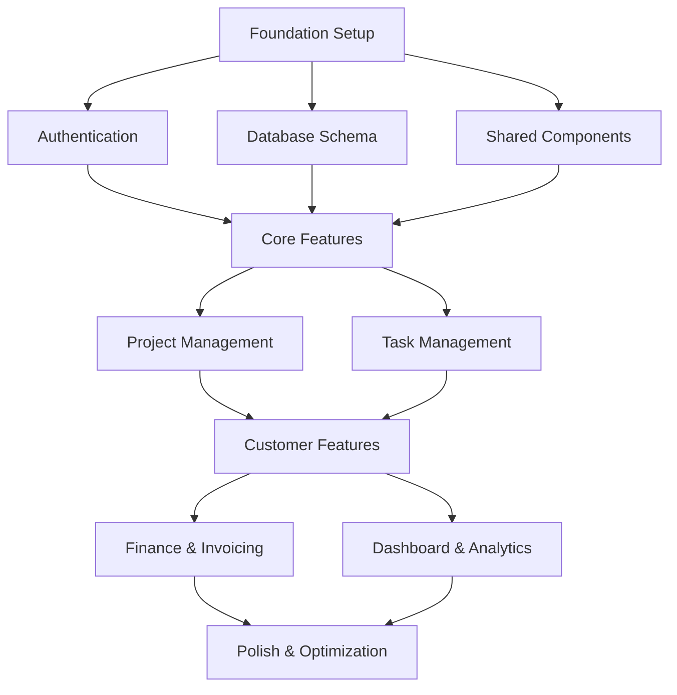

# Weber Management System - Implementation Plan

## Overview

This implementation plan outlines the development tasks for building the Weber Management System, a comprehensive project management platform with user management, project tracking, customer request handling, and invoicing capabilities.

**Technology Stack:**
- Frontend: Next.js 14 with TypeScript and React Server Components
- Backend: Next.js API Routes (BFF pattern)
- Database: PostgreSQL via Supabase
- Authentication: Supabase Auth with JWT tokens
- Styling: Tailwind CSS with custom theme (black/grey/#1976D2)

**Architecture:**
- Client Layer → API Routes → Supabase (Auth, Database, Storage)
- Row Level Security (RLS) for access control
- Role-based access control with 3 roles: admin, team_member, client

## Dependency Graph



## Tasks

### 1. Foundation Setup
**Status**: pending
**Priority**: high
**Complexity**: medium
**Estimated Hours**: 16

Setup Next.js project structure, Supabase configuration, and core utilities.

#### Sub-tasks:
- [ ] 1.1 Set up Next.js project structure with App Router
  - Configure TypeScript with strict mode
  - Set up path aliases for clean imports
  - Configure next.config.ts with image optimization
  - Set up environment variables template (.env.example)
  - Requirements: User & Access Management

- [ ] 1.2 Configure Supabase client
  - Create client.ts for browser-side operations
  - Create server.ts for server-side operations
  - Configure auth helpers for SSR
  - Set up real-time subscriptions infrastructure
  - Requirements: User & Access Management

- [ ] 1.3 Create theme system with black/grey/#1976D2
  - Define color tokens in Tailwind config
  - Create CSS variables for theming
  - Build theme provider component
  - Create layout wrapper with theme
  - Requirements: Cross-Module Integration

- [ ] 1.4 Set up utility functions and constants
  - Create date formatting utilities
  - Build currency formatting helpers
  - Create validation utilities
  - Define status enums and constants
  - Requirements: Project Management, Finance & Operations

- [ ] 1.5 Configure ESLint and Prettier
  - Set up lint-staged for pre-commit hooks
  - Configure TypeScript-aware ESLint rules
  - Add Tailwind CSS plugin to ESLint
  - Requirements: None

**Verification**: Project runs with `npm run dev`, theme applies correctly, Supabase connects successfully

---

### 2. Authentication System
**Status**: pending
**Priority**: high
**Complexity**: high
**Estimated Hours**: 24

Implement authentication system with role-based access control.

#### Sub-tasks:
- [ ] 2.1 Create auth provider and context
  - Build AuthProvider with Supabase auth state
  - Create useAuth hook for auth operations
  - Implement session management
  - Handle token refresh automatically
  - Requirements: 1.6, 1.8

- [ ] 2.2 Build login page
  - Create login form with email/password
  - Implement "Remember me" functionality
  - Add password visibility toggle
  - Handle login errors gracefully
  - Requirements: 1.1, 1.6

- [ ] 2.3 Build registration page
  - Create registration form with required fields
  - Implement email verification flow
  - Add organization creation step
  - Validate password strength
  - Requirements: 1.1, 1.2

- [ ] 2.4 Implement password reset flow
  - Create forgot password page
  - Build email sending functionality
  - Create reset password page with token validation
  - Add success/error messaging
  - Requirements: 1.6

- [ ] 2.5 Create protected route component
  - Build ProtectedRoute wrapper
  - Handle unauthenticated state with redirect
  - Show loading skeleton while checking auth
  - Requirements: 1.6, 1.7

- [ ] 2.6 Implement role-based permission hooks
  - Create usePermission hook
  - Build hasPermission function
  - Create useRole hook for role checking
  - Implement permission-based UI rendering
  - Requirements: 1.3, 1.6, 1.7

**Verification**: Users can login, register, and have correct role-based access

---

### 3. Database Schema
**Status**: pending
**Priority**: high
**Complexity**: medium
**Estimated Hours**: 12

Create Supabase database schema with RLS policies.

#### Sub-tasks:
- [ ] 3.1 Create SQL migration file
  - Design migration structure for reproducibility
  - Include up/down migration scripts
  - Add comments for each table creation
  - Requirements: User & Access Management

- [ ] 3.2 Define all 15 tables with relationships
  - Create users table with auth integration
  - Create profiles table for user details
  - Create organizations table
  - Create roles and permissions tables
  - Create user_roles junction table
  - Create projects and project_members tables
  - Create tasks table with self-reference for subtasks
  - Create customer_requests table
  - Create request_assignments table
  - Create invoices and invoice_items tables
  - Create payments table
  - Create comments table
  - Requirements: 1.1, 1.2, 2.1, 2.2, 2.3, 3.1, 3.2, 4.2

- [ ] 3.3 Add RLS policies for each table
  - Admin full access policies
  - Team member read/write policies
  - Client restricted access policies
  - User self-access policies
  - Organization-scoped policies
  - Requirements: 1.5, 1.6, 1.7, 2.7, 4.1, 4.8

- [ ] 3.4 Create indexes for performance
  - Add foreign key indexes
  - Create composite indexes for common queries
  - Add status and date indexes
  - Add text search indexes for names
  - Requirements: All

- [ ] 3.5 Seed initial data (roles, permissions)
  - Insert system roles (admin, team_member, client)
  - Create default permissions for each role
  - Add sample organization data
  - Requirements: 1.3

**Verification**: Database schema applies successfully, RLS policies work, foreign key relationships enforced

---

### 4. Shared UI Components
**Status**: pending
**Priority**: high
**Complexity**: high
**Estimated Hours**: 32

Create reusable UI component library with 17 components.

#### Sub-tasks:
- [ ] 4.1 Create form input components
  - Build Button component with variants (primary, secondary, danger, ghost)
  - Build Input component with label, error, and validation states
  - Build Select component with search and multi-select support
  - Build Textarea component with auto-resize option
  - Requirements: All requirements for forms

- [ ] 4.2 Create feedback components
  - Build Modal component with portal rendering
  - Build Toast component with auto-dismiss
  - Build Spinner component with sizes
  - Build EmptyState component with CTAs
  - Requirements: All

- [ ] 4.3 Create display components
  - Build Card component with header/footer
  - Build Badge component with status variants
  - Build Avatar component with fallback initials
  - Build Table component with sorting and pagination
  - Requirements: Project Management, Request Handling, Finance & Operations

- [ ] 4.4 Create navigation components
  - Build Dropdown menu with nested items
  - Build Tabs component for content sections
  - Build Pagination component
  - Build Breadcrumbs component
  - Requirements: All

- [ ] 4.5 Create advanced form components
  - Build Form component with validation schema
  - Build SearchBar component with debounce
  - Build DatePicker component
  - Build Checkbox/Radio components
  - Requirements: Project Management, Request Handling, Finance & Operations

**Verification**: All 17 components render correctly with theme applied, support keyboard navigation, pass accessibility checks

---

### 5. Core Layout
**Status**: pending
**Priority**: high
**Complexity**: medium
**Estimated Hours**: 16

Build layout components (sidebar, header, main content area).

#### Sub-tasks:
- [ ] 5.1 Create MainLayout component
  - Build responsive layout wrapper
  - Implement sidebar/header/content structure
  - Add mobile drawer for sidebar
  - Handle content scrolling independently
  - Requirements: All

- [ ] 5.2 Build Sidebar with navigation
  - Create navigation menu with icons
  - Implement collapsible sections
  - Add active state highlighting
  - Show role-based menu items
  - Requirements: 1.6, 1.7

- [ ] 5.3 Build Header with user menu
  - Create header with logo and title
  - Add user avatar dropdown menu
  - Include notification bell with badge
  - Add quick action buttons
  - Requirements: User & Access Management

- [ ] 5.4 Create responsive layout
  - Implement mobile breakpoint styles
  - Build hamburger menu for mobile
  - Handle sidebar toggle on mobile
  - Ensure all components responsive
  - Requirements: All

- [ ] 5.5 Implement breadcrumbs
  - Create breadcrumb navigation component
  - Generate paths from current route
  - Add home/dashboard link
  - Requirements: All

**Verification**: Layout displays correctly on all screen sizes, navigation works as expected

---

### 6. User Management
**Status**: pending
**Priority**: high
**Complexity**: high
**Estimated Hours**: 20

Implement user and organization management for administrators.

#### Sub-tasks:
- [ ] 6.1 Create user API routes
  - Build GET /api/users - list users with filters
  - Build GET /api/users/[id] - get user details
  - Build POST /api/users - create new user
  - Build PATCH /api/users/[id] - update user
  - Build DELETE /api/users/[id] - deactivate user
  - Implement role-based access on each endpoint
  - Requirements: 1.1, 1.2, 1.3, 1.4, 1.7

- [ ] 6.2 Build user list page
  - Create user table with search and filters
  - Add role filter dropdown
  - Implement pagination
  - Add status indicators
  - Requirements: 1.1, 1.6, 1.7

- [ ] 6.3 Build user detail page
  - Display user profile information
  - Show user's roles and permissions
  - Display activity history
  - Include action buttons (edit, deactivate)
  - Requirements: 1.1, 1.6

- [ ] 6.4 Implement organization settings
  - Create organization overview page
  - Build organization edit form
  - Implement logo upload
  - Add team member count display
  - Requirements: 1.4, 2.7

- [ ] 6.5 Create invite member flow
  - Build invite form with email and role
  - Send invitation email
  - Create pending invitations tracking
  - Handle invitation acceptance
  - Requirements: 1.2, 1.4

**Verification**: Users can be managed, organizations configured, invitations sent and tracked

---

### 7. Project Management
**Status**: pending
**Priority**: high
**Complexity**: high
**Estimated Hours**: 28

Build project CRUD and project member management with client restrictions.

#### Sub-tasks:
- [ ] 7.1 Create project API routes
  - Build GET /api/projects - list projects with filters
  - Build GET /api/projects/[id] - get project details
  - Build POST /api/projects - create new project
  - Build PATCH /api/projects/[id] - update project
  - Build DELETE /api/projects/[id] - archive project
  - Implement RLS-based filtering
  - Requirements: 2.1, 2.2, 2.3, 2.9, 5.1

- [ ] 7.2 Build projects list page
  - Create project cards/table view
  - Add status filter (planning, active, completed)
  - Implement search functionality
  - Add "Create Project" button
  - Requirements: 2.1, 2.6, 2.7

- [ ] 7.3 Build project detail page
  - Display project overview and progress
  - Show task summary and team members
  - Include timeline and budget info
  - Add action buttons based on role
  - Requirements: 2.1, 2.4, 2.5, 2.7

- [ ] 7.4 Create project form
  - Build multi-step project creation wizard
  - Include client selection dropdown
  - Add date pickers for start/end dates
  - Implement form validation
  - Requirements: 2.1, 2.2

- [ ] 7.5 Implement project member management
  - Create member list with roles
  - Build add member modal
  - Implement role assignment
  - Add remove member functionality
  - Requirements: 2.8, 2.9

- [ ] 7.6 Build project settings page
  - Allow project name and description editing
  - Implement status change workflow
  - Add archive confirmation
  - Requirements: 2.9

**Verification**: Projects can be created, viewed, edited with proper access control and client restrictions

---

### 8. Task Management
**Status**: pending
**Priority**: high
**Complexity**: high
**Estimated Hours**: 32

Implement task system with Kanban board and list views with progress tracking.

#### Sub-tasks:
- [ ] 8.1 Create task API routes
  - Build GET /api/tasks - list tasks with filters
  - Build GET /api/tasks/[id] - get task details
  - Build POST /api/tasks - create new task
  - Build PATCH /api/tasks/[id] - update task
  - Build DELETE /api/tasks/[id] - delete task
  - Implement bulk operations endpoint
  - Requirements: 2.3, 2.4, 2.5, 2.8, 5.2

- [ ] 8.2 Build tasks list view
  - Create table view with all task columns
  - Add sorting by date, priority, assignee
  - Implement filtering by status, assignee
  - Add inline editing for quick updates
  - Requirements: 2.3, 2.4, 2.5

- [ ] 8.3 Build Kanban board view
  - Create columns (backlog, todo, in_progress, review, done)
  - Implement drag-and-drop functionality
  - Add task cards with key information
  - Implement card reordering within columns
  - Requirements: 2.3, 2.4, 2.5, 2.8

- [ ] 8.4 Create task detail page
  - Display full task information
  - Show subtask list with progress
  - Include task history timeline
  - Add linked items section
  - Requirements: 2.3, 2.4, 2.5, 2.8

- [ ] 8.5 Implement task form
  - Build create/edit task modal
  - Include assignee selection with search
  - Add due date picker
  - Implement priority and status selection
  - Requirements: 2.3, 2.8

- [ ] 8.6 Add task comments and activity
  - Build comments section component
  - Implement real-time comment updates
  - Create activity log display
  - Add file attachment support
  - Requirements: 2.3, 2.4, 2.5, 2.8

**Verification**: Tasks can be managed in list and Kanban views, progress updates correctly, assignments work

---

### 9. Customer Requests
**Status**: pending
**Priority**: medium
**Complexity**: high
**Estimated Hours**: 24

Build customer request system with assignment workflow and routing.

#### Sub-tasks:
- [ ] 9.1 Create request API routes
  - Build GET /api/requests - list requests with filters
  - Build GET /api/requests/[id] - get request details
  - Build POST /api/requests - create new request
  - Build PATCH /api/requests/[id] - update request
  - Implement assignment endpoints
  - Requirements: 3.1, 3.2, 3.3, 3.8, 3.9

- [ ] 9.2 Build requests list page
  - Create request cards/table view
  - Add priority and status filters
  - Implement queue sorting (priority, date)
  - Add "New Request" button
  - Requirements: 3.1, 3.2, 3.9

- [ ] 9.3 Create request detail page
  - Display full request information
  - Show assignment history
  - Include communication timeline
  - Add action buttons based on role
  - Requirements: 3.4, 3.6, 3.7

- [ ] 9.4 Implement request assignment
  - Create assignment modal
  - Implement queue-based auto-assignment
  - Add reassignment functionality
  - Notify assignees of new tasks
  - Requirements: 3.3, 3.4, 3.5, 3.6

- [ ] 9.5 Add request comments
  - Build threaded comments component
  - Implement internal/public toggle
  - Add file attachments
  - Create mention functionality
  - Requirements: 3.7

- [ ] 9.6 Build request form for clients
  - Create simplified submission form
  - Include type selection and templates
  - Add priority and urgency options
  - Implement client-side validation
  - Requirements: 3.1, 3.8

**Verification**: Customer requests can be created, assigned, routed, tracked, and resolved

---

### 10. Invoice Management
**Status**: pending
**Priority**: medium
**Complexity**: medium
**Estimated Hours**: 24

Implement invoicing and payment tracking with line items.

#### Sub-tasks:
- [ ] 10.1 Create invoice API routes
  - Build GET /api/invoices - list invoices with filters
  - Build GET /api/invoices/[id] - get invoice details
  - Build POST /api/invoices - create new invoice
  - Build PATCH /api/invoices/[id] - update invoice
  - Build POST /api/invoices/[id]/payments - add payment
  - Implement status transition logic
  - Requirements: 4.2, 4.3, 4.4, 4.5, 4.6

- [ ] 10.2 Build invoices list page
  - Create invoice table with status badges
  - Add date range filter
  - Implement client filter
  - Show payment status indicators
  - Requirements: 4.2, 4.6, 4.8

- [ ] 10.3 Create invoice detail page
  - Display full invoice with items
  - Show payment history
  - Add status timeline
  - Include action buttons (send, print, pay)
  - Requirements: 4.2, 4.5, 4.6

- [ ] 10.4 Implement invoice items
  - Build line items editor
  - Calculate totals and taxes
  - Implement quantity/price validation
  - Add sort order management
  - Requirements: 4.4

- [ ] 10.5 Add payment tracking
  - Build payment recording form
  - Implement partial payment handling
  - Update invoice balance automatically
  - Generate payment receipts
  - Requirements: 4.5, 4.6

- [ ] 10.6 Build invoice form
  - Create multi-step invoice wizard
  - Include client/project selection
  - Add line item management
  - Implement tax and discount calculations
  - Requirements: 4.2, 4.3, 4.4

**Verification**: Invoices can be created, viewed, and payments tracked with accurate totals

---

### 11. Dashboard & Analytics
**Status**: pending
**Priority**: medium
**Complexity**: medium
**Estimated Hours**: 16

Build dashboard with statistics, activity feed, and quick access widgets.

#### Sub-tasks:
- [ ] 11.1 Create dashboard API routes
  - Build stats aggregation endpoints
  - Create recent activity query
  - Implement pending tasks fetch
  - Build project summary endpoint
  - Requirements: 4.8, 5.5

- [ ] 11.2 Build stats cards
  - Create summary cards (projects, tasks, requests, invoices)
  - Implement trend indicators
  - Add quick action buttons
  - Include period selector (week/month/quarter)
  - Requirements: 4.8

- [ ] 11.3 Implement activity feed
  - Create activity stream component
  - Group activities by type
  - Add activity filters
  - Implement real-time updates
  - Requirements: 5.5

- [ ] 11.4 Add recent projects widget
  - Display recent project list
  - Show progress indicators
  - Include quick actions
  - Link to full project list
  - Requirements: 2.6

- [ ] 11.5 Create pending tasks view
  - Show high priority tasks
  - Add quick complete action
  - Group by due date
  - Limit to 5-10 items
  - Requirements: 2.4, 2.5, 5.2

**Verification**: Dashboard displays relevant statistics, activity updates in real-time, provides quick access

---

### 12. Settings & Profile
**Status**: pending
**Priority**: low
**Complexity**: medium
**Estimated Hours**: 16

Implement user settings and profile management.

#### Sub-tasks:
- [ ] 12.1 Create profile settings page
  - Build profile form with all fields
  - Implement avatar upload
  - Add name/contact editing
  - Implement timezone and locale selection
  - Requirements: 1.1

- [ ] 12.2 Build organization settings
  - Create organization details form
  - Implement logo upload
  - Add member management
  - Create settings categories
  - Requirements: 1.4, 2.7

- [ ] 12.3 Implement notification preferences
  - Build notification settings form
  - Add email/push toggle options
  - Implement category preferences
  - Add frequency selector
  - Requirements: 1.1

- [ ] 12.4 Add security settings
  - Create password change form
  - Implement session management
  - Add 2FA setup option
  - Build login history view
  - Requirements: 1.6

- [ ] 12.5 Create billing settings (admin)
  - Build subscription overview
  - Create invoice history view
  - Add payment method management
  - Implement usage tracking
  - Requirements: 4.8

**Verification**: Users can manage their profile, notifications, and security settings

---

### 13. Polish & Optimization
**Status**: pending
**Priority**: low
**Complexity**: medium
**Estimated Hours**: 24

Performance optimization, accessibility improvements, and bug fixes.

#### Sub-tasks:
- [ ] 13.1 Optimize bundle size
  - Analyze bundle with @next/bundle-analyzer
  - Code split large components
  - Remove unused dependencies
  - Lazy load non-critical routes
  - Target: <200KB gzipped initial bundle
  - Requirements: Cross-Module Integration

- [ ] 13.2 Improve loading times
  - Add skeleton loaders
  - Implement optimistic updates
  - Optimize database queries
  - Add proper loading states
  - Requirements: All

- [ ] 13.3 Fix accessibility issues
  - Add ARIA labels to all interactive elements
  - Ensure keyboard navigation works
  - Add skip links for main content
  - Verify color contrast ratios
  - Target: WCAG 2.1 AA compliance
  - Requirements: All

- [ ] 13.4 Add error boundaries
  - Create route-level error boundaries
  - Implement component error recovery
  - Add graceful degradation UI
  - Build error reporting integration
  - Requirements: All

- [ ] 13.5 Implement error tracking
  - Integrate error monitoring service
  - Add user feedback form
  - Implement error logging
  - Create error dashboard
  - Requirements: Cross-Module Integration

- [ ] 13.6 Final testing and fixes
  - Run full test suite
  - Test on real devices
  - Fix reported bugs
  - Performance regression testing
  - Requirements: All

**Verification**: Application meets performance goals (<200KB bundle), passes accessibility audit, handles errors gracefully

---

## Task Dependency Graph

```json
{
  "waves": [
    { "id": 0, "tasks": ["1.1", "1.2", "1.3", "1.4", "1.5"] },
    { "id": 1, "tasks": ["2.1", "2.2", "2.3", "3.1", "3.2", "3.3", "3.4", "3.5"] },
    { "id": 2, "tasks": ["2.4", "2.5", "2.6", "4.1", "4.2", "4.3", "4.4", "4.5"] },
    { "id": 3, "tasks": ["5.1", "5.2", "5.3", "5.4", "5.5"] },
    { "id": 4, "tasks": ["6.1", "6.2", "6.3", "6.4", "6.5"] },
    { "id": 5, "tasks": ["7.1", "7.2", "7.3", "7.4", "7.5", "7.6"] },
    { "id": 6, "tasks": ["8.1", "8.2", "8.3", "8.4", "8.5", "8.6"] },
    { "id": 7, "tasks": ["9.1", "9.2", "9.3", "9.4", "9.5", "9.6"] },
    { "id": 8, "tasks": ["10.1", "10.2", "10.3", "10.4", "10.5", "10.6"] },
    { "id": 9, "tasks": ["11.1", "11.2", "11.3", "11.4", "11.5"] },
    { "id": 10, "tasks": ["12.1", "12.2", "12.3", "12.4", "12.5"] },
    { "id": 11, "tasks": ["13.1", "13.2", "13.3", "13.4", "13.5", "13.6"] }
  ]
}
```

---

## Total Estimated Hours

| Phase | Tasks | Estimated Hours |
|-------|-------|-----------------|
| Foundation Setup | 1.1 - 1.5 | 16 |
| Authentication System | 2.1 - 2.6 | 24 |
| Database Schema | 3.1 - 3.5 | 12 |
| Shared UI Components | 4.1 - 4.5 | 32 |
| Core Layout | 5.1 - 5.5 | 16 |
| User Management | 6.1 - 6.5 | 20 |
| Project Management | 7.1 - 7.6 | 28 |
| Task Management | 8.1 - 8.6 | 32 |
| Customer Requests | 9.1 - 9.6 | 24 |
| Invoice Management | 10.1 - 10.6 | 24 |
| Dashboard & Analytics | 11.1 - 11.5 | 16 |
| Settings & Profile | 12.1 - 12.5 | 16 |
| Polish & Optimization | 13.1 - 13.6 | 24 |
| **Total** | **77 tasks** | **264 hours** |

---

## Notes

- Tasks within the same wave can be executed in parallel
- Earlier waves are prerequisites for later waves
- Each task builds on previous work and should be verified before moving on
- The dependency graph ensures safe parallel execution while respecting task order